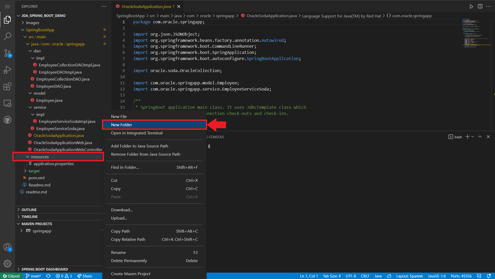
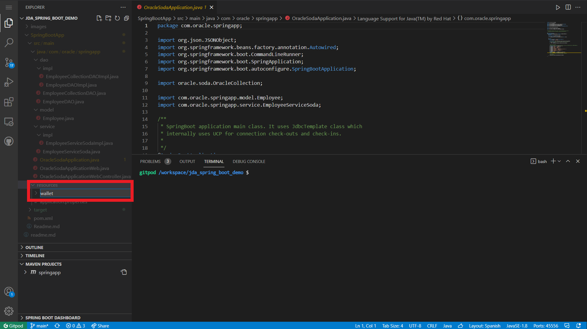
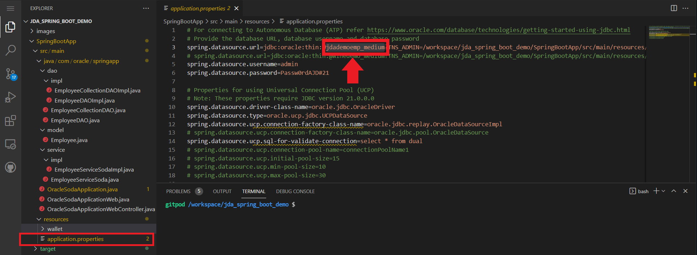

# Oracle SODA and Spring Boot
This Demo will show you how to create a Spring Boot application with Oracle JDBC and SODA to manage an Autonomous JSON Database.
You will use GITPOD as development environtment. GitPod is a container based Visual Studio Code environtment ready to use from GitHub repositories. You can get more information about [Gitpod here](https://www.gitpod.io/).

## Summary
1. Create an Autonomous JSON Database.
2. Fork the Github project to your github user.
3. Install GitPod Chrome extension.
4. Connect the Spring Boot App with Autonomous JSON Database.

## Creating the Oracle Autonomous JSON Database
In this chapter you will learn how to create an Autonomous JSON Databse (AJDB). This JSON db will store collections and JSON documents. You must have an OCI (Oracle Cloud) account to create the AJDB. First access to your OCI tenantcy and click in the main menu Oracle Databases.


Then click in Autonomous JSON Database to access the AJDB OCI menu.


Next click in the **Create Autonomous Database** button to start the creation process.


Please select your compartment and write a descriptive database display name and database internal name (14 char max). Keep selected **JSON** database type and **Shared Infraestructure**. Check **Always Free** to create the database as free tier and select **21c** version (or 19c if you want to upgrade to a paid version in the future).


Next write an *ADMIN* password, it must have Capital letters, numbers and special character so we recomend something like **Passw0rdAJD#21**. Keep the other fields as default and click in **Create Autonomous Database** button.


After a few minutes your AJD will change from Orange (provisioning) to Green (Available).

## Fork the github project.
First step to follow the demo is to fork the github project in your own repository. So sing up in github with your user and fork the **jda_spring_boot_demo** repository. This process will clone the repository in your user repository space.


## GITPOD Chome Extension.
To use Gitpod with your web browser (Chrome) you will have to install a chrome extension. Gitpod extension is in the Chrome marketplace and you can get it [here](https://chrome.google.com/webstore/detail/gitpod-dev-environments-i/dodmmooeoklaejobgleioelladacbeki)

Please add the extension to use gitpod for that demo.


After adding the gitpo extension you will receive a succenfull message.


Then you can access to your github forked **jda_spring_boot_demo** repository that store the code of the SODA Spring Boot app. If the GitPod extension is enabled you'll see a new green button in the github panel.


Now you can click in the **gitpod** green button to create a gitpod workspace. 


That gitpod workspace will use the github repository to create your visual studio workspace in the gitpod cloud platform. 


This gitpod workspace will be linked to your github repository and you will can do git push to modify the code from the gitpod environtment for instance.


## AJDB Connection using wallet.
In this section you will connect the springboot application with yor AJDB using the wallet security file.

First Click in **DB Connection** button.


Then Click in **Download Wallet** button.


Write a password for the wallet file. You can use the same password that you use for ADMIN access (**Passw0rdAJD#21**). Then Click **Download** button to download the database wallet to your computer/laptop in zip format.


Next, go to your GitPod workspace and under *resource* folder right click and create **New Folder**.



Write **wallet** as a Folder name.



Next, right click over wallet folder and click Upload menu item to upload the database wallet zip file.


Then go to **TERMINAL** window in the GitPod workspace and change your folder to 
```sh
cd SpringBootApp/src/main/resources/wallet
```


Next unzip the uploaded wallet zip file in the wallet folder.
```sh
unzip <your_wallet_zip>
```


Now you can delete the zip file if you want. Check *tnsnames.ora* file to get the dabase **connection service name**, something like **<your_databasename_medium>**


Next check **application.properties** spring boot file and write your connection service name in the **spring.datasource.url** parameter. Change your password if you didn't use **Passw0rd#21**



Then go to *MAVEN PROJECTS* at the bottom of the visual studio workspace, and right click to **compile** the application.


Wait maven compile your spring boot app and then right click over **OracleSodaApplicationWeb.java** file to **Run Java**


The application is a web service that initialize a web server in the **8080** port. Then you get several messages in the **TERMINAL** window. In the botton right you can see a new little window with 3 buttons. Click Open Preview to open a preview embebed web browser. First time you must write after the brower URL **/initialize** to create the **employee** collection in the AJDB.


Then you can use the **TERMINAL** window to launch a cURL command to create employees in the AJDB employee collection.

```sh
curl -X POST http://localhost:8080/insert -H 'cache-control: no-cache' -H 'Content-Type: application/json' -d '{"empno":"100","name":"Ivan","job":"Cloud Architect","manager":"10","hiredate":"2021-07-07T13:41:57Z","salary":"20000","commission":"5000","deptno":"5"}'
```


Then you can change **/initialize** by **/display** to see all the collection employee in the web browser and in the **TERMINAL** window as an Array of JSON documents.


